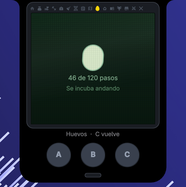
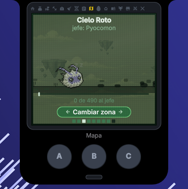
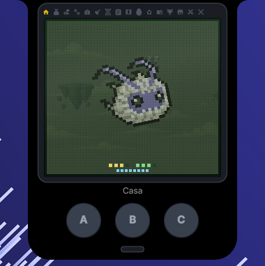
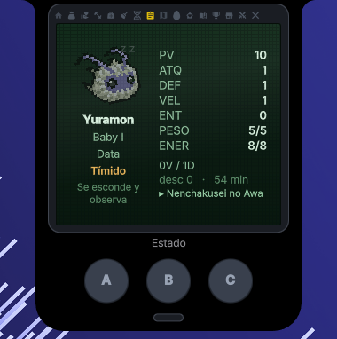
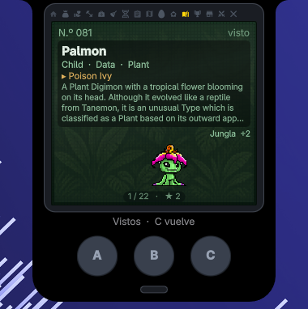
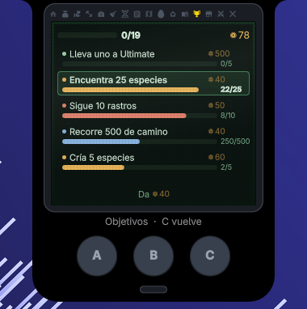
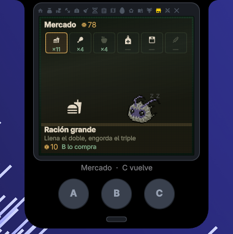
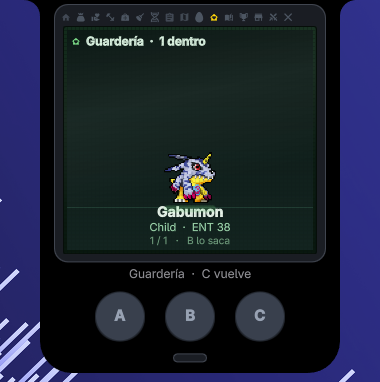

# Digivice — a virtual pet that runs on how you use your computer

A Digimon-style virtual pet living inside **k4**, a Dynamic-Island bar for
Hyprland written in Quickshell: the island panel *is* the device. Bezel,
dot-matrix LCD, three physical buttons, and one screen at a time — no tabs, no
desktop chrome.

The twist is where it gets its fuel. The 1998 device had a pedometer. There is
no pedometer here, but there is an honest measure that you are moving around:
**switching windows, switching workspaces, launching applications**. Every
gesture is a stride down the road of the current zone, milestones are *placed*
along that road, and the boss waits at the end of it. Raising a creature is
something that happens while you work.

**It reads nothing.** Not window titles, not PIDs, not application names — only
*that* something changed, and *how many* windows exist. Same for music: it can
tell your pet to dance when something is playing, but never what.

| | |
|:--:|:--:|
|  |  |
| **It starts with an egg**, and the egg hatches by walking. The pose comes from the progress, not from a timer, and it wobbles faster the closer it gets. | **The road of the zone.** Milestones sit at fixed kilometres and the boss waits at the end. Every window you switch to slides the world a little. |
|  |  |
| **It sleeps from 22:00 to 08:00**, lying on its side. Waking it up counts as neglect — this device does not owe you a pet on demand. | **Four trainable stats**, weight, energy and a personality that decides what it asks for and how often. A rule you cannot see is a rule you cannot play against. |
|  |  |
| **1488 species**, filled in as you meet them. Artwork and text are fetched on first use, never bundled. | **Goals and bits**, the currency. Walk 500 of road, meet 25 species, raise 5 — the long game behind the daily care. |

## What's in it

**Care, on a schedule.** Hunger, mood, weight, dirt, illness, sleep from 22:00
to 08:00, neglect and de-evolution at the bottom of it. The day's feeding and
petting moments are generated from a stable seed rather than dripped from a
timer, so asking "what happened while I was away" is exact, and two creatures
raised at once never get hungry at the same minute.

**An egg first.** A new game starts with an egg, not a creature. It hatches by
walking — same strides that move the road — with a six-pose sprite sheet driven
by progress, not by a timer: first crack at 65 %, split at 92 %, and it wobbles
faster the closer it gets.

**Evolution that costs three things at once**: time in the current stage,
battles won, and experience. All three are shown with their numbers, because a
device that says "not yet" without saying what's missing turns raising into
superstition. Baby I → Baby II → Child → Adult → Perfect → Ultimate, plus
Armor, X and Warp, plus **Jogress** — fuse two creatures from the nursery into
a third that belongs to neither line (3498 pairs, taken from the API's
`condition` field).

**A road, not a random encounter table.** Nine zones, each with a distance
(250 for the first, 3689 for the ninth), events placed at specific kilometres,
and a boss forced to the very end. Zone roads can be re-run, and the new lap
puts the milestones somewhere else.

**Battles you watch and interrupt.** The fight resolves on its own every
1200 ms with the same criteria your opponent uses; the three buttons are
*interventions* that rule the next exchange and are then spent. Attack beats
charge, guard beats attack, charge beats guard. Attack shapes come from the
species archetype (twelve drawings) and the halo from its attribute, so "a leaf
with a purple halo" reads as a virus plant without a label.

**And the rest**: hunting minigame, food that spoils, a market and a bank,
achievements, an encyclopedia, code-based PvP, per-creature personalities that
change what they ask for and how they fight, and sound.

| | |
|:--:|:--:|
|  |  |
| **The market**, where bits go. Selling never pays more than buying — otherwise it would be an infinite loop. | **The nursery** holds the ones you are not carrying, and it is where two of them fuse into a third. |

`docs/DIGIVICE.md` is the long version — the design document, including every
decision that isn't obvious and why the first attempt at it was wrong.

## Requirements

This is a **repo plugin**, not a standalone one: it needs
`services/Digivice.qml`, which uses `Quickshell.Io` and Hyprland's signals —
things k4's plugin API deliberately does not hand to external plugins. So it
does not drop into `~/.config/k4/plugins/` the way
[senda](https://github.com/k4ditano/senda) or
[grieta](https://github.com/k4ditano/grieta) do; it has to live inside a k4
checkout.

**Heads up:** k4 itself is a private repository at the moment, so the install
steps below are only actionable if you already have it. This repo is published
so the game's code and its design document can be read on their own.

- k4 (Quickshell + Hyprland)
- Node.js, only if you want to run the rule tests

## Install

The tree here mirrors k4's, so installing is copying:

```sh
git clone https://github.com/k4ditano/digivice
cd digivice
cp -r plugins/Digivice ~/.config/quickshell/k4/plugins/
cp services/Digivice.qml services/DigiviceReglas.js ~/.config/quickshell/k4/services/
cp tools/digivice_* ~/.config/quickshell/k4/tools/
cp docs/DIGIVICE.md ~/.config/quickshell/k4/docs/
```

Then register it:

1. Add `singleton Digivice 1.0 Digivice.qml` to `services/qmldir`.
2. Add the plugin entry to `plugins/catalog.json`:
   ```json
   {
     "id": "digivice",
     "entry": "Digivice/DigivicePlugin.qml",
     "version": "1.0.0",
     "title": "Digivice",
     "enabledByDefault": false,
     "icono": "0xF06D3",
     "aplicacion": true
   }
   ```
3. Run `python3 tools/plugins.py` from the k4 checkout to validate and
   regenerate `qmldir`.
4. **Restart the bar.** A new singleton in `services/` is not picked up by a
   hot reload — `pluginReload` only reloads the plugin's own folder.
5. Turn it on in k4's settings. It ships disabled: nobody gets a game switched
   on for them.

Save data lives in `~/.local/state/k4/plugins/digivice/partida.json`, and
downloaded sprites next to it in `img/`.

## Driving it from the shell

Everything the buttons do is reachable over IPC, which is also how it gets
tested:

```sh
quickshell ipc -p ~/.config/quickshell/k4/shell.qml call k4.digivice estado
quickshell ipc -p ~/.config/quickshell/k4/shell.qml call k4.digivice ver mapa
quickshell ipc -p ~/.config/quickshell/k4/shell.qml call k4.digivice comer
quickshell ipc -p ~/.config/quickshell/k4/shell.qml call k4.digivice camino
```

## Tests

The rules are pure JavaScript in `services/DigiviceReglas.js`, on purpose, so
they run without starting the bar:

```sh
node tools/digivice_test.js      # the rules are correct
node tools/digivice_balance.js   # the game is playable
python3 tools/digivice_glifos.py # every icon draws what it claims to draw
```

`digivice_balance.js` reads the service's constants instead of copying them, so
they cannot drift apart. It exists because "it's balanced" without numbers is
an opinion. `digivice_glifos.py` exists because of a bug no validator could
catch: the icon codepoints all existed, so nothing errored — they just drew the
wrong things. The ration was a pig, the meat a camcorder, and the trail was the
Rollup.js logo.

## Where the data and art come from

Species data comes from [digi-api.com](https://digi-api.com) — CC-BY-SA 3.0,
sourced largely from [Wikimon](https://wikimon.net) — and is frozen into
`plugins/Digivice/datos/`: 1488 entries with stage, attribute, type, fields,
techniques and the evolution graph.

Sprites are **not bundled**. They are fetched on first use and cached in the
user's state directory. Device sprites come from Wikimon through its MediaWiki
API, preferring the colour one and falling back to the classic one-bit LCD art;
1113 of 1488 have a device sprite, 855 of them in colour. The rest fall back to
digi-api's official artwork.

That is also why some creatures show up in black and white: it is not a filter
gone wrong. Wikimon keeps a sprite per device, and **only 14 of the 54 devices
ever made draw in colour** — so 258 species have no colour sprite anywhere.
`tools/digivice_sprites.py` *measures* the colour rather than guessing from the
device's name.

Backgrounds (`plugins/Digivice/fondos/`), the egg sheet and the sound effects
are original to this project.

## Licence

The **code** — every `.qml`, `.js` and `.py` file here — is [MIT](LICENSE), and
so are the original assets: the zone backgrounds, the egg sprite sheet and the
sound effects.

Two things in this repository are **not** mine to relicense, so MIT does not
reach them:

- `plugins/Digivice/datos/*.json` is derived from
  [digi-api.com](https://digi-api.com), sourced largely from
  [Wikimon](https://wikimon.net). It stays under **CC-BY-SA 3.0**: keep the
  attribution and share derivatives alike.
- Digimon names, characters and designs are **Bandai** trademarks. Nothing here
  licenses them. The sprites are not redistributed at all — they are fetched
  from Wikimon at runtime into the user's own cache.

## Fan project

Digimon and all related names, characters and designs are trademarks of
**Bandai**. This is a non-commercial fan project with no affiliation with,
endorsement by, or connection to Bandai or any of its partners.

It is an **original adaptation**. The genre was studied to understand it — no
emulator is loaded and no code, graphics or data are copied from one. The
game logic here is written from scratch; the species data is the CC-BY-SA
material credited above, and the artwork is fetched from its source at runtime
rather than redistributed.

If you own rights to any of the referenced material and want something removed,
open an issue.
